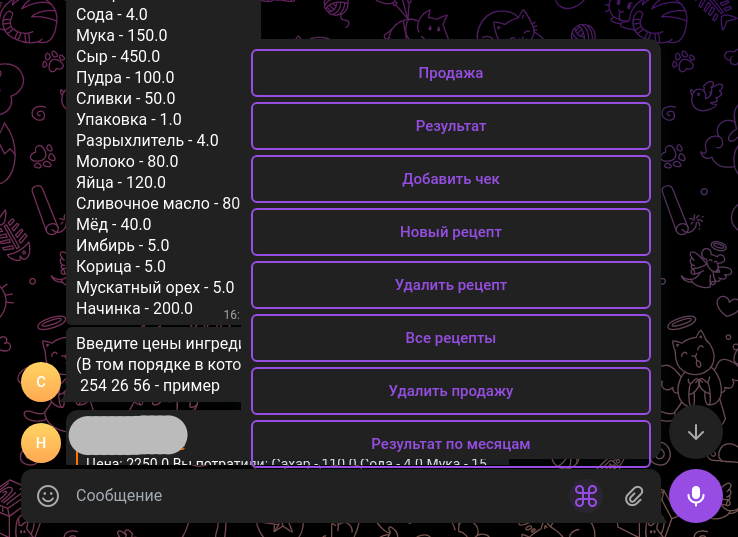

# Глава 1: "Сладкая" жизнь

Эта история будет о долгом пути к DataSience. Очень долгом пути ...

## Начало

Одним длинным вечером, я прогуливался со своей подругой, которая на тот момент неплохо готовила торты, в какой-то момент это "неплохо" даже переросло в пару заказов для подруг и близких. Именно этим вечером я поучаствовал в разговоре который известен каждому, кто работает с бизнесом:
> \- Заказов слишком мало, чтоб это стало бизнесом - сказала, мне подруга  
> \- Так давай запустим рекламу, ведь людям нравиться, то что ты делаешь!  
> \- Ты что? Денег нет!

И вот эта вечная фраза: "Денег нет!", о которую разбиваются все начинающие проекты. Подсознательно я понимал, что с таким "оборотом" как у нее выделить немного денег на рекламу не сложная вещь, но сложно аргументировать свою позицию, когда "бизнес" не ведет ни какую статистику.

## Волевое решение

Когда аналитик спускается до "Ну это точно так! Булкой с маком клянусь" это не разговор, а потому было принято решение проанализировать расходы и доходы этого "гиганта кондитерского дела". Благо для решения этой задачи хватило бы и **Excel** (Да, восславятся имена тех, кто создал этот фундамент мировой экономики.) Потратив недолгий вечер, был собран файл в котором можно было добавлять состав тортов и вести учет по количеству продаж. Идеально выверенные формулы и таблицы были готовы принять в себя сотни заказов и десятки рецептов. Все было опубликованно на **Google Docs**, где я надеялся в скором времени увидеть прибыль и сказать: "Ага, вот она!".

Конечно же, по закону мультивселенной в этот момент вселенная поделилась на две: Одна в которой все прошло как задумано, а вторая, та в которой я пишу этот текст.

> - А как добавить?
> - А куда писать?
> - А что это за цифра?
> - А у меня меньше денег осталось?
> - А как же затраты на скисшее молоко, которое я выкинула?

Все это и многое другое, что сниться мне в страшном сне. На этом моменте, я сделаю маленькое отступление (Пока я совсем не остался без друзей) и уточню, что сейчас я разрабатываю систему для хранения и анализа промокомпаний в крупной компании и ... Там все так же! Так как крупные "дяденьки" и строгие "тетеньки" учились несколько лет тому как вести бизнес, а не как делать запросы в SQL. Поэтому вспомнив мысль, которой мама описывала нежелание разбираться в моих мудреных фразах:

> *Хочешь, чтобы ежики тебя понимали говори на языке ежиков! - цитаты великих людей*

я приступил к единственному верному решению, я написал **UI (*User Interface*)**. В прошлой статье я привел не мало аргументов почему Telegram отличная платформа для таких Pet проект интерфейсов, сейчас же я расскажу с чем я столкнулся реализовав свою задумку.

## Я сделал! 

Написав обертку для UI в Телеграме, я приступил к созданию бота-бухгалтера, чей функционал вы можете наблюдать на скриншоте.

Схема была простая:
1. Пользователь присылает команду ее обрабатывает главный метод, который на основе команды вызывает специализированные подметоды (Результат, Продажа и тд).
2. Далее Pandas открывает файл нужного месяца и добавляет туда нужные записи или читает оттуда. 
3. После бот отправляет результат или уточнение в чат с пользователем.

Простота, с которой я реализовал этот проект, потянула за собой кучу подводных камней, которые раскрывались по мере работы с ботом.

## Я сделал выводы!

### Отсутсвие логов:
Я торопился реализовать готовый продукт и поэтому проигнорировал главное правило прода: *"Делай логи!"*. Это аукнулось сразу, когда через несколько минут после запуска мне пришло сообщение:

> \- Я нажала как ты сказал, а он не отвечает...

***print()*** конечно спасал, но попробуйте найти в консоле с десятком сообщений именно то, которое сломало вашу програму. Это занятие скучное и сложное. К тому моменту когда это стало настоящей проблемой, у меня не было времени переписывать или как-то исправлять проект и мне пришло отличное решение, которое спасло кучу времени: я перевел бота в групповой чат и теперь видел точно какое сообщение привело к ошибке. Приятным дополнением для меня было преимущество, которого нет у большинсва разработчиков: я напрямую вижу как пользователь работает с моим продуктом.

### Одим месяц - один файл:
Все записи были разбиты на месяцы по двум причинам: 
1. Я не хотел держать в памяти открытый DataFrame, а значит, чтобы его быстро считывать и записывать его надо делать маленьким.
2. Выводя результат за месяц, если в одном файле - один месяц, я могу просто сложить один столбец с группировкой по товарам.  

В свою очередь это повлеко за собой и минусы:
1. Неправильная реализация этого момента привела к тому, что некоторые записи мигрировали из одного месяца в следующий, когда их вводишь поздно или когда бот давно не перезапускался
2. Так же, чтобы реализовать общий вывод результатов приходилось считывать все DataFrame, а потом обьединять их воедино.

Сделав выводы я встал на путь истинный...