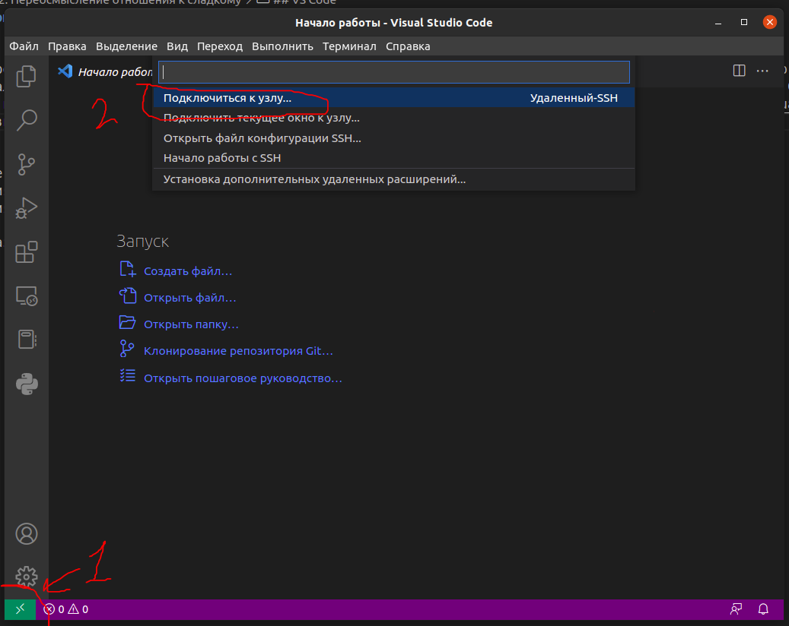
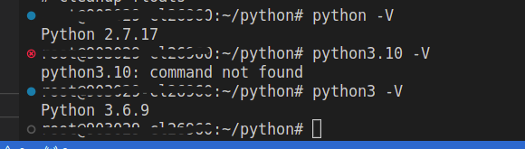

# Глава 2: Переосмысление отношения к сладкому

Эту главу я хотел бы посвятит переосмыслению набора инструментов разработки 

## VS Code
Начнем с малого... Я решил перевести бота на сервер, а так как это Pet-проект и времени на перекидывание с DEV машины на PROD сервер нет, было принято волевое решение программировать на удаленном сервере. Для этого было настроенно [SSH соединение](https://losst.pro/kak-polzovatsya-ssh). VS Code, который я начал использовать в нашей компании и теперь не могу перестать, на мое счастье поддерживает [редактирование кода по SSH](https://code.visualstudio.com/docs/remote/ssh#_getting-started). Установив [Remoute - SSH](https://marketplace.visualstudio.com/items?itemName=ms-vscode-remote.remote-ssh), я жал так:
1. Удаленное подключение
2. "Подключиться к узлу"
3. "Добавить новый узел SSH"
4. Вводим свой логин и адрес в виде ***user@ip_adres:port***



Готово! Я на сервере  и ~~могу положить PROD одной кнопкой~~ могу писать код и запускать на той машине на которой он будет работать.

### Плюсы:
1. Быстро (Не требуется: Запушил, открыл сервер, запулил, запустил), можно запускать с такой же частотой, с которой я жал CTRL + S в PyCharm или Eclipse.
2. Не возникнет проблем при "переезде"

### Минусы:
1. В процессе разработки накапливается мусор, который вычищается при "переезде"
2. Любая ошибка (Коих много в разработке), положит PROD, что явно не понравиться пользователям

## SQL
Поедем далее. Как говорилось в прошлой главе, я столкнулся с двумя задачами:
1. Разработать систему хранения промо кампаний на рабочем месте 
2. Переработать систему ведения учета в боте (Pet - проект)

С этими задачами я пришел к Базам Данных (БД). Готов выслушать: "Это же очевидное решение!" и тд, но мы должны понимать, что пока проект ведется одним человеком, он ~~и жнец, и жрец, и на дуде игрец~~ занимается большим количеством задач, которые не свойственны его профилю. Поэтому лезть туда, где я ни разу не был не очень то и хотелось. Об остальных переживаниях я описал в прошлой главе.

Приступим к [установке PostgreSQL](https://losst.pro/ustanovka-postgresql-ubuntu-16-04).
После установки PostgreSQL расположился на localhost на 5432 порту. И нам надо будет создать нового пользователя, так как стандартный закрыт, для стороннего подключения и умные "дядечки" говорят, что это не спроста.
[Попробуем присоединиться к нему из вне](https://www.dmosk.ru/miniinstruktions.php?mini=pgsql-remote).
На свою локальную машину я поставил pgAdmin 4 и заставив Postgre слушать внешние порты подключился к БД.

## Python
Самое сложное для себя я сделал, теперь последний шаг перед программированием - подготовим Python.
Из коробки шел не самый новый интерпритатор.



Скачаем [новую версию](https://cloudbytes.dev/snippets/upgrade-python-to-latest-version-on-ubuntu-linux) и добавим **alias**:

```bash 
nano ~/.bashrc
```

И в самом конце добавляем:

```bash
alias python='python3.10'
```

Теперь мы видим следующее:
```bash
user:~/python# python -V
Python 3.10.8
```

Перейдем в директорию проекта и создадим там [виртуальное окружение](https://pythonchik.ru/okruzhenie-i-pakety/virtualnoe-okruzhenie-python-venv):
```bash
python -m venv venv
```

Теперь мы полностью готовы к коду!